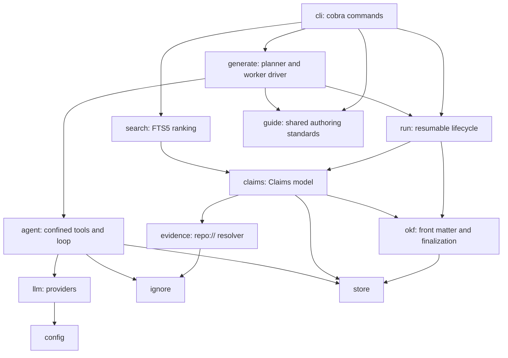

# Architecture Overview

owcli is a clean-room Go reimplementation of the repository ("code") side of
[OpenWiki](https://github.com/langchain-ai/openwiki). It generates a linked
Markdown wiki for a Git repository with its own LLM agent loop, grounds the
wiki's factual statements in versioned source evidence ("Claims"), keeps the
output conformant with the Open Knowledge Format (OKF) v0.2, and searches it.
The behavioral specification lives in `docs/design.md`; that document also
lists what is deliberately out of scope (MCP server, parallel page workers,
the visualizer, coding-agent integrations, personal mode, workspaces,
GitHub Actions scheduling, telemetry, translation).

## Package layering

Everything lives under `internal/`, with `cmd/owcli/main.go` only calling
`cli.NewRootCommand().Execute()`. Dependencies point strictly downward:

Arrows point from a package to the packages it imports.

- **Leaf packages.** `store` (layouts, bindings, atomic JSON state), `ignore`
  (`.openwikiignore`), and `config` have no internal dependencies. See
  [Storage Layouts and Bindings](storage-and-bindings.md).
- **Deterministic core.** `evidence`, `claims`, `okf`, `search`, and `run`
  contain no model calls; every rule they enforce is testable without a model.
  See [Grounded Claims](../concepts/grounded-claims.md),
  [OKF Front Matter and Finalization](../concepts/okf-output.md), and
  [Wiki Search and Read](../concepts/search.md).
- **Model-facing layer.** `llm` speaks to providers, `agent` runs the tool
  loop over a confined workspace, and `generate` composes them with the `run`
  lifecycle. See [Model Providers](../integrations/model-providers.md) and
  [Generation Run Lifecycle](../workflows/generation-run.md).
- **Shared standards.** `guide` holds the planning, page, and Claim standards
  as text. owcli's own agent prompts and the instructions printed for
  interactive coding agents both use it, so there is one standard.

## How a command flows

`owcli init` / `owcli update` resolve configuration and the wiki layout, build
a provider, and call `generate.Generate`. That function calls `run.Begin`
(fresh, resumed, or a clean-update no-op), runs a planner agent if the run is
still planning, then loops over `run.Next`: snapshot the page, run a worker
agent, and either accept the page (the worker's `submit_page` tool calls
`run.SubmitPage`) or roll it back with `run.Skip`. Unrecoverable worker errors
abort the loop with the run left resumable; otherwise `run.Finish` performs
deterministic finalization.

During `Finish`, the OKF passes run in a fixed order and Claims evidence is
projected into front matter through the `ClaimSources` hook, which calls
`claims.SyncSources`, so `okf` never imports `claims`.

`owcli run begin|plan|next|inspect|submit|skip|finish` expose the same
lifecycle to an interactive coding agent, one JSON step per command, so the
agent researches and writes pages and owcli calls no model at all. See
[Agent-Driven Runs](../workflows/agent-driven-runs.md).

`owcli search`, `read`, `status`, and `check` never call a model. `search`
builds an in-memory SQLite FTS5 index per query and ranks wiki sections with
weighted BM25.

## Two storage layouts

Every component receives a resolved `store.Layout`. In the **in-repo** layout
the wiki is `<repo>/openwiki`; in the **external** layout it lives under
owcli's data directory and nothing is written into the repository, which is
how owcli explores other people's projects. In both cases page identifiers
look like `/openwiki/<path>.md`, and the repository's own top-level
`openwiki/` directory is never treated as source.

## Compatibility with upstream OpenWiki

The on-disk format matches upstream: directory layout, front matter
conventions, sidecar and manifest schemas, `repo://` evidence syntax, and
evidence version tokens. A wiki produced by either tool can be searched,
checked, and updated by the other. Opt-in compatibility tests prove this
against upstream's own wiki; see [Testing](../testing/overview.md).
