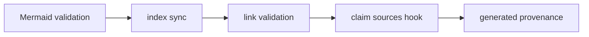

# OKF Front Matter and Finalization

owcli writes wikis in the [Open Knowledge Format v0.2](https://github.com/GoogleCloudPlatform/knowledge-catalog/blob/main/okf/SPEC.md):
a directory of Markdown files with YAML front matter. The `internal/okf`
package guarantees conformance after authoring, so the persisted wiki is valid
no matter what a model wrote. A **concept page** is any `.md` file under the
wiki root except `index.md`, `log.md`, `INSTRUCTIONS.md`, and hidden paths.

## Validation

`Validate` returns structured issues (`missing_type`, `invalid_title`, ...)
instead of failing on the first problem; `nil` means conformant.

- The front matter block is the text between a first line of exactly `---`
  and the next line of exactly `---`. CRLF is tolerated.
- The block must be a YAML mapping without duplicate keys.
- `type` is required. `title`, `description`, `resource`, and the legacy
  `timestamp` must be non-empty strings when present. `tags` must be a list
  of non-empty strings.
- `generated` must be a `{by, at}` event; `verified` may be one event or a
  list; `sources` entries need a non-empty `resource`; `status` is `draft`,
  `stable`, or `deprecated`.
- `at` and `stale_after` must be real calendar datetimes with an explicit `Z`
  or `±hh:mm` offset, so freshness never depends on a reader's timezone.

Values follow YAML's core schema: an unquoted timestamp stays a string.
`Fields`, the read-only accessor other packages use, converts YAML nodes
itself because the YAML library would otherwise turn timestamps into
`time.Time`.

## Conservative repair

`Repair` makes the smallest truthful change:

1. Valid front matter is returned byte-for-byte unchanged.
2. A parseable mapping is fixed field by field:
   - a missing `type` becomes `Reference` plus `openwiki_generated: true`;
   - a bad `title` is re-derived from the first H1 or the file name;
   - invalid optional scalars and unprovable trust fields are removed;
   - `sources` and `verified` are filtered down to their valid entries.
3. Only unparseable YAML is replaced by a minimal block with `type`, `title`,
   and `openwiki_generated: true`.

Producer extension fields survive surgical repair. All upstream pages pass
validation unchanged (see [Testing](../testing/overview.md)).

## Line-preserving edits

Most writes edit raw lines instead of re-rendering the whole block, which
would drop extensions and comments:

- `SetField` writes one JSON-quoted scalar;
- `SetGenerated` writes `generated: { by: "...", at: "..." }`;
- `SetValue` renders one structured field as block YAML;
- `RemoveField` drops a field and its continuation lines, and the whole block
  if it becomes empty.

A field spans its key line plus following blank or indented lines. A missing
field is appended; a missing block is created.

Ownership is split: authors (the model) write `type`, `title`, `description`,
and `tags`; owcli owns `generated`, `verified`, and `sources`.

## Finalization passes

`Wiki.Finalize` runs after authoring, in a fixed order:



Index sync follows Mermaid so it sees final front matter. Links follow indexes
so they see final hrefs. Claim sources and provenance read page bodies, so
they run last.

**Mermaid.** `ExtractMermaid` finds ```` ```mermaid ```` fences and ignores
fences nested in longer or info-tagged fences. owcli has no JavaScript Mermaid
parser, so `MermaidHeuristic` flags only near-certain flowchart breakage:

- a node named `end`;
- a `;`, `<`, or `>` inside an *unquoted* label, after quoted strings, HTML
  entities, and `<br>` tags are discounted.

Other diagram types are not checked. A failing fence becomes a `text` fence
preceded by `<!-- openwiki: mermaid parse failed ... -->`, using upstream's
marker so either tool's next update can repair it. The heuristic is
intentionally stricter about false positives than upstream's fallback: it
never flags a diagram upstream's real parser accepted.

**Indexes.** `SyncIndexes` writes an `index.md` in every visible directory:

- files are listed by front matter title (basename fallback) with their
  description;
- subdirectories are listed after the files;
- entries are sorted case-insensitively by href;
- the root index carries `okf_version: "0.2"`.

An index is rewritten only when its content changes. Each concept is repaired
on the way, and a `MetadataReport` lists pages with code-derived metadata or
no description. The report is informational and never fails a run.

**Links.** `ValidateLinks` checks relative links and GitHub-style heading
anchors:

- broken links get a `<!-- openwiki: broken internal link ... -->` comment
  above the line, and stale comments are stripped first, so a fixed link
  leaves no trace;
- root-absolute links are flagged;
- external links, and anchors on non-Markdown targets (like `#L10` on source
  files), are ignored;
- links to a directory without a trailing slash are allowed.

Targets resolve in repository coordinates with the wiki mounted at
`/openwiki`, so a page can link to `../src/x.go` in both storage layouts.
`CheckLinks` reports the same issues without writing; `owcli check` uses it.

**Claim sources.** An optional `ClaimSources` callback, supplied by the run as
`claims.SyncSources`, projects evidence into `sources`. See
[Grounded Claims](grounded-claims.md).

**Provenance.** Before authoring, `SnapshotProvenance` records each page's
body hash (front matter excluded) and its prior `generated` event.
`FinalizeProvenance` then compares bodies:

- a new or changed body gets `{by: producer, at: now}` (with per-page
  overrides), loses the legacy `timestamp`, and gets a normalized trailing
  newline;
- an unchanged body gets its prior event restored, so front-matter-only
  rewrites never advance it.

The snapshot serializes into the run checkpoint, so it survives a restart
between the two phases. See [Generation Run Lifecycle](../workflows/generation-run.md).
