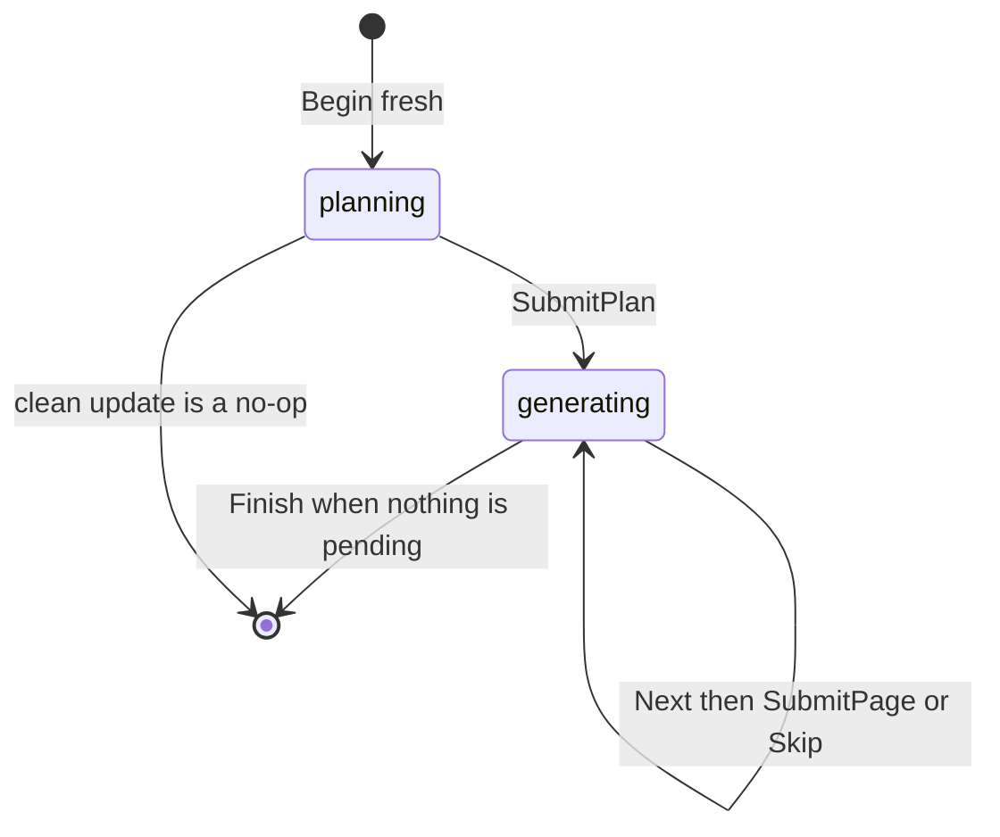

# Generation Run Lifecycle

Generating or updating a wiki is a **run**. Three packages share the work:

- `internal/run` owns durable state and every rule about ordering and
  durability. It is deterministic.
- `internal/agent` runs a model in a tool-calling loop over a confined view of
  the repository.
- `internal/generate` connects the two: a planner agent, then one worker
  agent per page.

## The lifecycle

**Begin.** `Begin(env, mode, message)` loads `.run.json` if it exists.

- **Resume.** The mode must match; otherwise `Conflict`. Skipped jobs return
  to pending. If the source fingerprint changed since the plan was made, the
  plan is dropped and the run goes back to planning.
- **Fresh update.** Front matter is repaired, Claims preflight runs, and the
  update is a **no-op** when all of these hold:
  - no user message was given;
  - the last run completed at the current HEAD;
  - the source tree is clean;
  - no Claim has a grounding issue;
  - every page's manifest `pageVersion` matches its bytes.
- **Fresh init.**
  1. The existing wiki is copied to a temporary backup.
  2. Everything except `INSTRUCTIONS.md` is cleared, and a default
     `INSTRUCTIONS.md` is written if none exists.
  3. The backup is restored if anything fails before the new checkpoint is
     durable.

A new checkpoint records the run id, mode, HEAD, source fingerprint, the
pages that existed, and a provenance snapshot.

**SubmitPlan.** Normalizes page paths, drops duplicates, and rejects
reserved pages. An init plan must include `quickstart.md` and may not delete
pages. The quickstart can never be deleted, and a page cannot be both written
and deleted. Updates gain automatic jobs for pages whose Claims have
grounding issues. Jobs are sorted by path with the quickstart last, so it is
written after the pages it routes to. Resubmitting the same plan is a no-op; a
different plan is rejected.

**Next.** Returns the first pending job without reserving it, with whether the
page exists, its Claim count, and only the Claims that need attention.

**SubmitPage.** This is the durability boundary. For the current job only:

1. repair the page's front matter;
2. reconcile the sparse Claim decisions (see
   [Grounded Claims](../concepts/grounded-claims.md));
3. finalize Claims, excluding every other pending page;
4. prove the page durable and record it in the manifest;
5. only then mark the job complete in the checkpoint.

Errors with code `InvalidInput` are correctable by the worker. If
finalization fails, the Claims runtime is rebuilt from durable state so the
retry starts clean.

**Skip.** Restores the page and its sidecar exactly from the snapshot taken
before the worker ran, marks the job skipped, and records the wiki as
`interrupted`.

**Finish.** Requires no pending jobs and a snapshot for every skipped job.
Then:

1. restore skipped pages;
2. delete pages left behind by a superseded plan, plus planned deletions;
3. run the OKF passes with Claim sources (see
   [OKF Front Matter and Finalization](../concepts/okf-output.md));
4. finalize Claims and prove the whole wiki durable (skipped pages excluded);
5. re-check the fingerprint;
6. rebuild the manifest. Only pages this run completed get the run's source
   checkpoint, others keep theirs with a refreshed `pageVersion`, and skipped
   pages are left exactly as they were;
7. write `.last-update.json` as `complete`, or `interrupted` if anything was
   skipped or the source drifted;
8. delete `.run.json` last, so any earlier failure leaves the run resumable.

## Source fingerprint

The fingerprint hashes HEAD plus the path and content of every tracked and
untracked file that is visible as source: not git-ignored, not excluded by
`.openwikiignore`, and not the wiki. Any read failure is an error rather than
a guess, because the fingerprint decides whether a plan is still valid. The
clean-tree check uses `git status` with the same exclusions.

## Agents

`generate.Generate` drives the run:

- **Planner.** Runs with the read-only tools plus `submit_plan`. Its prompt
  carries:
  - the mode;
  - existing pages with titles and descriptions;
  - pages with grounding issues;
  - the last documented commit;
  - the user's message;
  - `INSTRUCTIONS.md`.

  A successful `submit_plan` ends the planner's loop.
- **Worker, per job.** The page is snapshotted, and the workspace's writable
  set becomes exactly that page. The worker gets read tools, `write_file`,
  `edit_file`, `inspect_page_claims`, and `submit_page`. Its prompt names the
  page, title, purpose, seed paths, Claims needing attention, the whole plan
  (for linking), and the instructions. The system prompts (`prompts.go`) spell
  out the OKF authoring rules and the Claim standard.

Lifecycle errors coded `InvalidInput` go back to the model as tool errors so
it can fix the page or its Claims. Any other lifecycle error stops the loop
and aborts the run. An agent that ends its turn without submitting is nudged
twice before the attempt counts as abandoned.

Failure handling per page:

- completed via `submit_page`: kept, even if something fails afterwards;
- the worker gave up, hit the step limit (80 model calls), or was refused: the
  page is skipped and the run continues;
- any other error (provider failure, cancellation): the page is skipped and
  the run aborts. Rerunning the same command resumes straight into the
  remaining pages.

`owcli init`/`update` wire SIGINT and SIGTERM to context cancellation, so
Ctrl-C behaves like the last case.

## The confined workspace

`agent.Workspace` presents one virtual tree: `openwiki/...` maps to the wiki
root in either storage layout, and everything else to the repository.

- Reads honor `.openwikiignore`, refuse `..` segments and symlinks that leave
  the root, refuse binary and over-4 MiB files, and never show the wiki's
  hidden control files.
- In the external layout the repository's own `openwiki/` directory is hidden,
  since it may be a stale upstream wiki.
- Writes go only to the assigned page.
- There is no shell: `git_log` runs `git log` with fixed arguments.

Tools: `ls`, `glob` (with `**` and `{a,b}`), `grep` (RE2), `read_file`
(numbered, paged), `git_log`, `write_file`, and `edit_file` (exact match,
unique unless `replace_all`). Output is capped, so a search cannot flood the
context.

`agent.Run` is the loop:

- tool failures and panics come back as error results;
- a `max_tokens` stop without tool calls gets a "continue, keep inputs
  smaller" nudge;
- a refusal or the step limit ends with an error;
- a tool can return `Stop` to end the loop.

Provider details are in [Model Providers](../integrations/model-providers.md).
